# RISC-V CPU 架构设计方案与系统框图

> 基于 Nexys 4 DDR (Artix-7 XC7A100T) 的 RISC-V 处理器设计
> 课程：项目式课程阶段2 — 题目B：基于FPGA开发板的处理器设计

---

## 目录

1. [架构方案对比总览](#1-架构方案对比总览)
2. [方案一：单周期 RISC-V CPU（基础层次）](#2-方案一单周期-risc-v-cpu基础层次)
3. [方案二：多周期 RISC-V CPU（基础层次）](#3-方案二多周期-risc-v-cpu基础层次)
4. [方案三：五级流水线 RISC-V CPU（进阶层次）](#4-方案三五级流水线-risc-v-cpu进阶层次)
5. [方案四：完整 SoC 系统架构（进阶层次）](#5-方案四完整-soc-系统架构进阶层次)
6. [系统框图集合](#6-系统框图集合)
7. [方案选择建议](#7-方案选择建议)

---

## 1. 架构方案对比总览

### 1.1 四种架构方案对比

| 维度 | 方案一：单周期 | 方案二：多周期 | 方案三：五级流水线 | 方案四：完整SoC |
|------|-------------|-------------|----------------|--------------|
| **CPI** | 1 | 3~5 | 理想1（实际1.2~1.5） | 理想1（含Cache miss开销） |
| **时钟频率** | 低（~25MHz） | 中（~50MHz） | 高（~100MHz） | 高（~80MHz） |
| **复杂度** | 低 | 中 | 高 | 很高 |
| **开发周期** | 1~2周 | 2~3周 | 3~4周 | 5~6周 |
| **关键路径** | 取指→译码→执行→访存→写回 | 各阶段拆分 | 流水线寄存器 | 总线+Cache |
| **资源占用** | 少 | 少 | 中 | 多 |
| **适用层次** | 基础 | 基础 | 进阶 | 进阶 |
| **RV32I支持** | 完整 | 完整 | 完整 | 完整+M扩展 |

### 1.2 架构演进路线

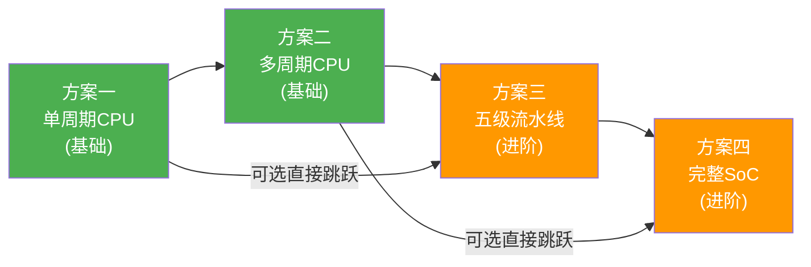

### 1.3 整体设计层次结构

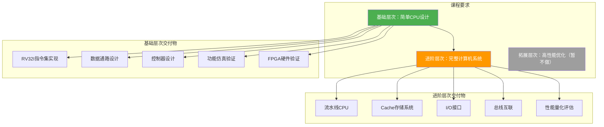

---

## 2. 方案一：单周期 RISC-V CPU（基础层次）

### 2.1 架构概述

单周期CPU在单个时钟周期内完成一条指令的完整执行。所有指令共用同一时钟周期，时钟周期由最慢指令（Load指令）决定。

- **指令集**：RV32I 子集（37条核心指令）
- **数据通路**：组合逻辑为主，无流水线寄存器
- **存储器**：哈佛结构（指令存储器与数据存储器分离）
- **控制器**：纯组合逻辑，根据opcode生成控制信号

### 2.2 数据通路框图

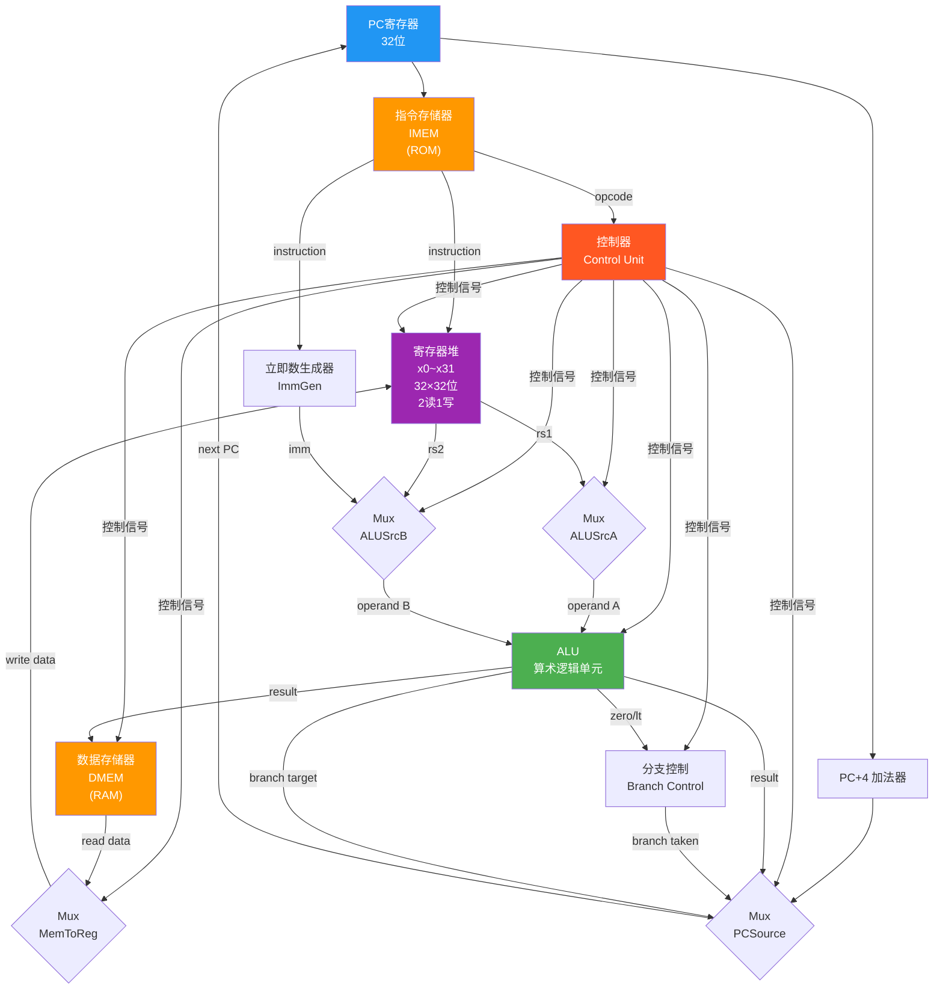

### 2.3 控制信号表

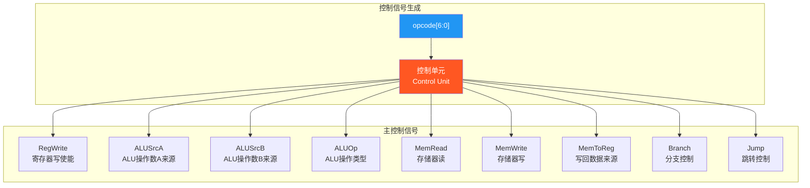

### 2.4 关键模块设计

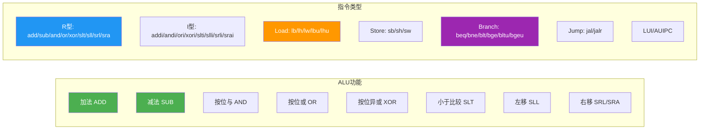

### 2.5 优缺点分析

| 优点 | 缺点 |
|------|------|
| 结构简单，易于理解和调试 | 时钟周期长（由最慢指令决定） |
| 每条指令CPI=1 | 关键路径长，频率低 |
| 无冒险问题 | 资源利用率低（ALU每周期空闲部分时间） |
| 适合快速验证指令集正确性 | 不适合实际产品应用 |

---

## 3. 方案二：多周期 RISC-V CPU（基础层次）

### 3.1 架构概述

多周期CPU将指令执行拆分为多个时钟周期，每个周期完成一个子操作。不同指令使用不同周期数。

- **指令集**：RV32I 子集
- **数据通路**：共享存储器（冯·诺依曼结构），单存储器分时复用
- **控制器**：有限状态机（FSM）驱动
- **周期分配**：取指(IF) → 译码(ID) → 执行(EX) → 访存(MEM) → 写回(WB)

### 3.2 控制器状态机

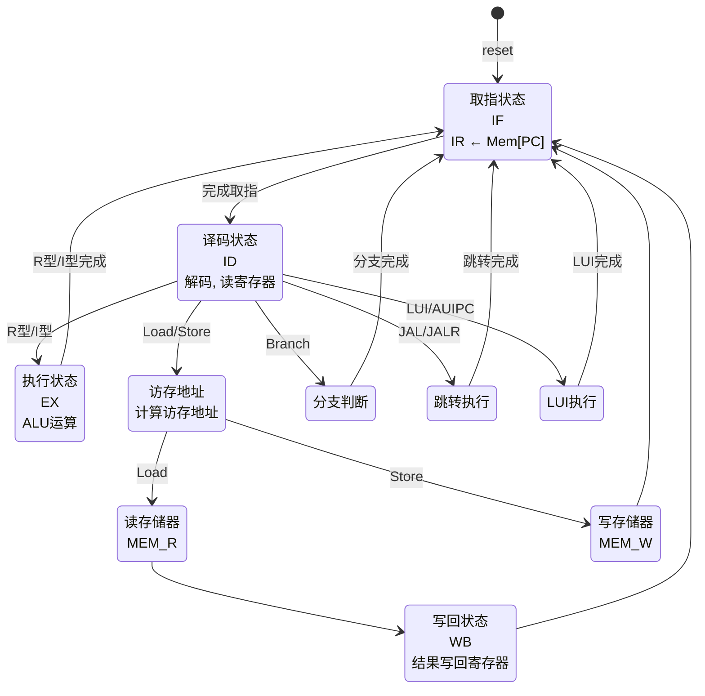

### 3.3 数据通路框图

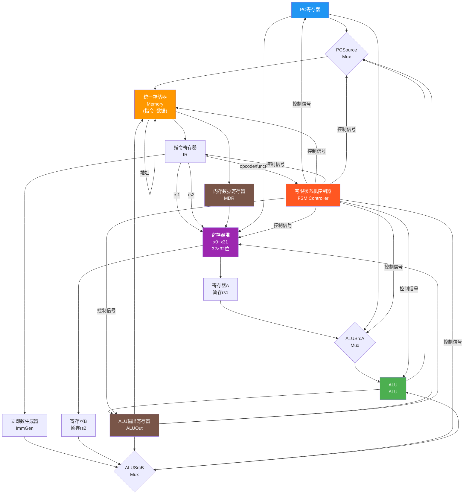

### 3.4 指令周期数分配

```mermaid
graph TD
    subgraph R型指令 3周期
        R1["周期1: IF<br/>取指令"]
        R2["周期2: ID<br/>译码+读寄存器"]
        R3["周期3: EX<br/>ALU运算+写回"]
        R1 --> R2 --> R3
    end

    subgraph Load指令 5周期
        L1["周期1: IF"]
        L2["周期2: ID"]
        L3["周期3: EX<br/>计算地址"]
        L4["周期4: MEM<br/>读存储器"]
        L5["周期5: WB<br/>写回寄存器"]
        L1 --> L2 --> L3 --> L4 --> L5
    end

    subgraph Store指令 4周期
        S1["周期1: IF"]
        S2["周期2: ID"]
        S3["周期3: EX<br/>计算地址"]
        S4["周期4: MEM<br/>写存储器"]
        S1 --> S2 --> S3 --> S4
    end

    subgraph Branch指令 3周期
        B1["周期1: IF"]
        B2["周期2: ID"]
        B3["周期3: EX<br/>比较+更新PC"]
        B1 --> B2 --> B3
    end

    style R1 fill:#4CAF50,color:#fff
    style L1 fill:#FF9800,color:#fff
    style S1 fill:#2196F3,color:#fff
    style B1 fill:#9C27B0,color:#fff
```

### 3.5 优缺点分析

| 优点 | 缺点 |
|------|------|
| 时钟周期短（单级组合逻辑） | CPI > 1，整体吞吐量不一定高 |
| 不同指令可使用不同周期数 | 控制器FSM复杂 |
| 共享存储器节省资源 | 串行执行，无指令重叠 |
| 关键路径短，频率可较高 | 状态机调试较复杂 |

---

## 4. 方案三：五级流水线 RISC-V CPU（进阶层次）

### 4.1 架构概述

五级流水线将指令执行分为5个阶段，允许多条指令同时在不同阶段执行。

- **指令集**：RV32I 完整 + M扩展（可选）
- **流水线级数**：IF → ID → EX → MEM → WB
- **冒险处理**：数据前递 + Load-Use停顿 + 分支冲刷
- **目标性能**：IPC ≈ 0.85~0.95

### 4.2 流水线架构总图

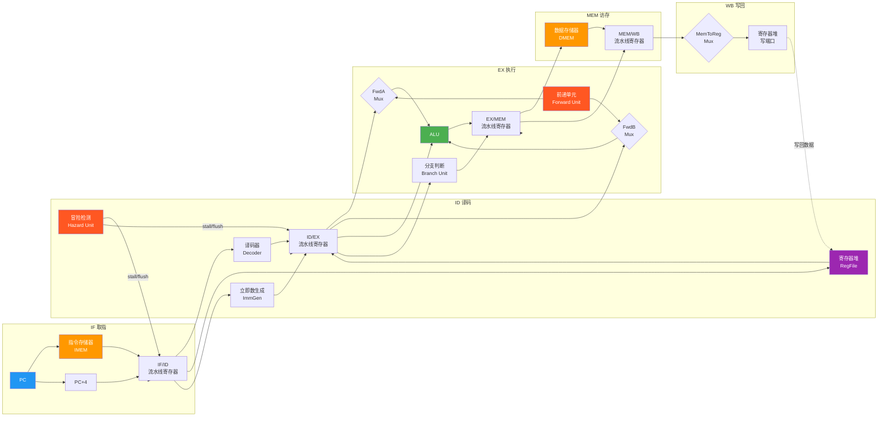

### 4.3 数据冒险与前递路径

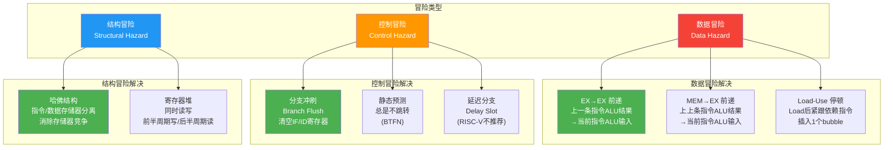

### 4.4 前递逻辑详解

```mermaid
graph TD
    subgraph 前递场景1_EX到EX
        EX1_1["指令i: add x5, x6, x7"]
        EX1_2["指令i+1: sub x8, x5, x9"]
        EX1_3["i在EX/MEM阶段时<br/>i+1在EX阶段"]
        EX1_4["前递: EX/MEM.ALUOut → EX输入"]
        EX1_1 --> EX1_2 --> EX1_3 --> EX1_4
    end

    subgraph 前递场景2_MEM到EX
        EX2_1["指令i: add x5, x6, x7"]
        EX2_2["指令i+1: nop"]
        EX2_3["指令i+2: sub x8, x5, x9"]
        EX2_4["i在MEM/WB阶段时<br/>i+2在EX阶段"]
        EX2_5["前递: MEM/WB.ALUOut → EX输入"]
        EX2_1 --> EX2_2 --> EX2_3 --> EX2_4 --> EX2_5
    end

    subgraph LoadUse停顿
        LU1["指令i: lw x5, 0(x6)"]
        LU2["指令i+1: sub x8, x5, x9"]
        LU3["i在MEM阶段时<br/>i+1在EX阶段"]
        LU4["无法前递!<br/>Load数据MEM阶段才出来"]
        LU5["插入1个bubble<br/>stall PC和IF/ID<br/>清除ID/EX控制信号"]
        LU1 --> LU2 --> LU3 --> LU4 --> LU5
    end

    style EX1_4 fill:#4CAF50,color:#fff
    style EX2_5 fill:#4CAF50,color:#fff
    style LU4 fill:#F44336,color:#fff
    style LU5 fill:#FF9800,color:#fff
```

### 4.5 流水线时序图

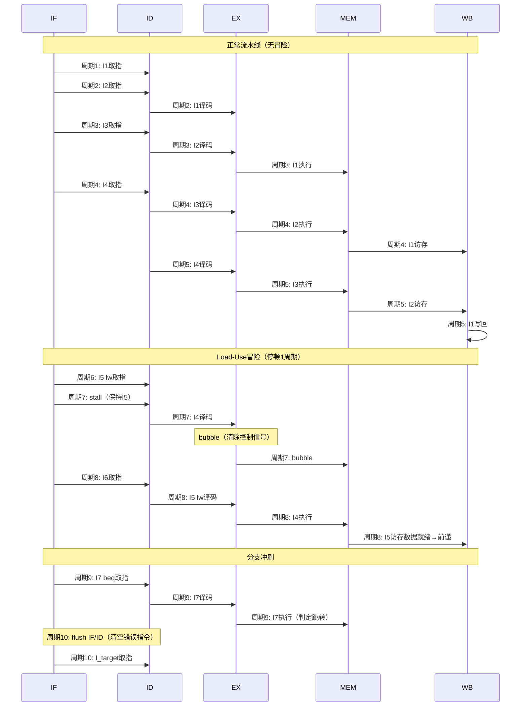

### 4.6 分支处理策略

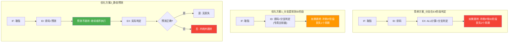

### 4.7 优缺点分析

| 优点 | 缺点 |
|------|------|
| 高吞吐量（理想IPC=1） | 设计复杂度高 |
| 时钟频率高（关键路径短） | 冒险处理逻辑复杂 |
| 资源利用率高 | 调试困难（时序相关） |
| 适合进阶层次要求 | 需要仔细验证前递逻辑 |

---

## 5. 方案四：完整 SoC 系统架构（进阶层次）

### 5.1 架构概述

在五级流水线CPU基础上，集成Cache、总线、外设接口，构建完整可运行的计算机系统。

- **CPU核心**：五级流水线 RISC-V (RV32I + M扩展)
- **存储层次**：L1 I-Cache + L1 D-Cache + 主存(BRAM/DDR)
- **总线**：自定义总线或 Wishbone/AXI-Lite
- **外设**：UART、GPIO、Timer、中断控制器

### 5.2 SoC 系统顶层框图

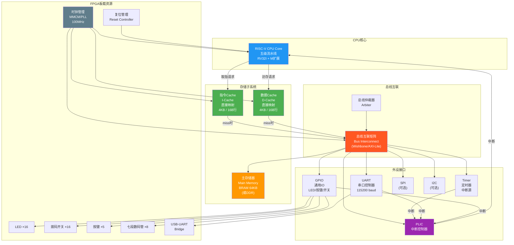

### 5.3 存储层次结构

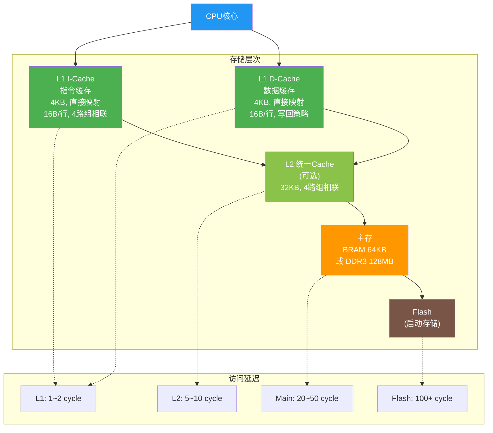

### 5.4 Cache 结构设计

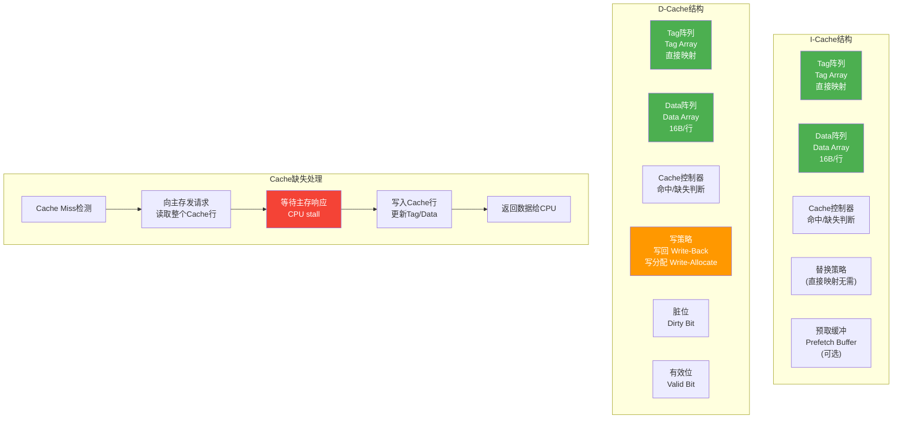

### 5.5 总线协议与互联

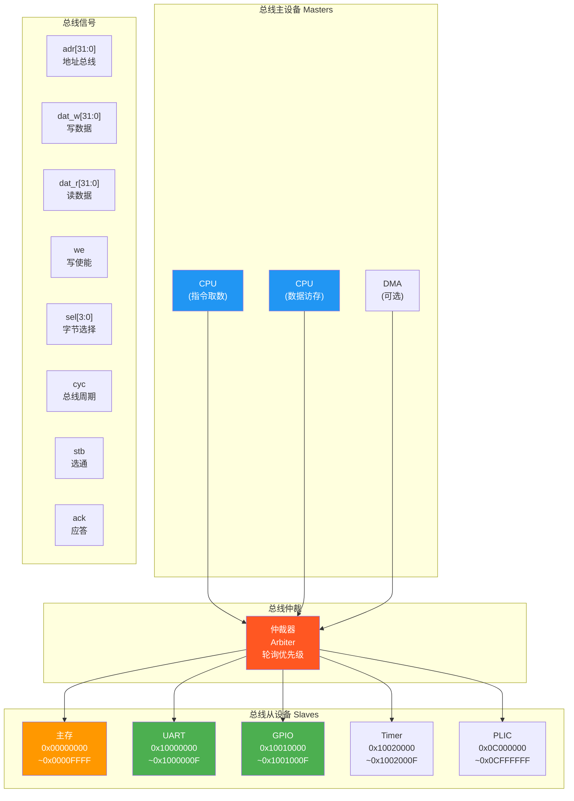

### 5.6 地址空间映射

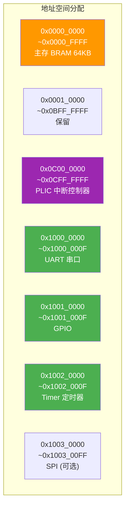

### 5.7 中断处理流程

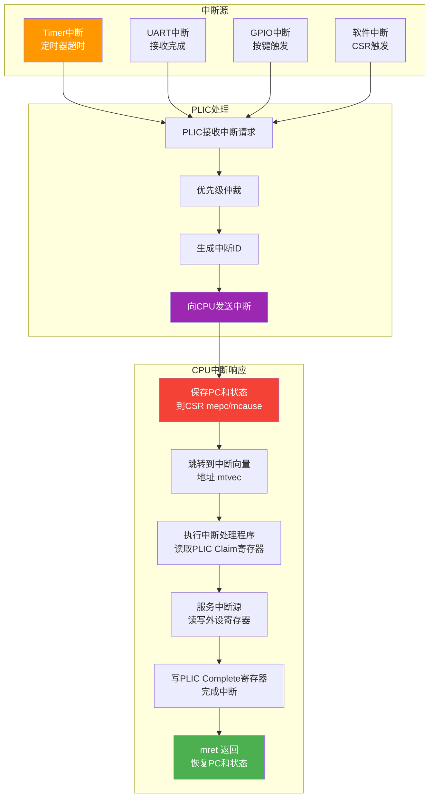

### 5.8 优缺点分析

| 优点 | 缺点 |
|------|------|
| 完整可运行的计算机系统 | 设计复杂度最高 |
| 满足进阶层次全部要求 | 需要大量调试时间 |
| 可运行真实程序 | Cache一致性需考虑 |
| 性能量化分析有数据支撑 | 总线协议需仔细设计 |
| 可扩展性强 | 资源占用大 |

---

## 6. 系统框图集合

### 6.1 顶层系统架构图

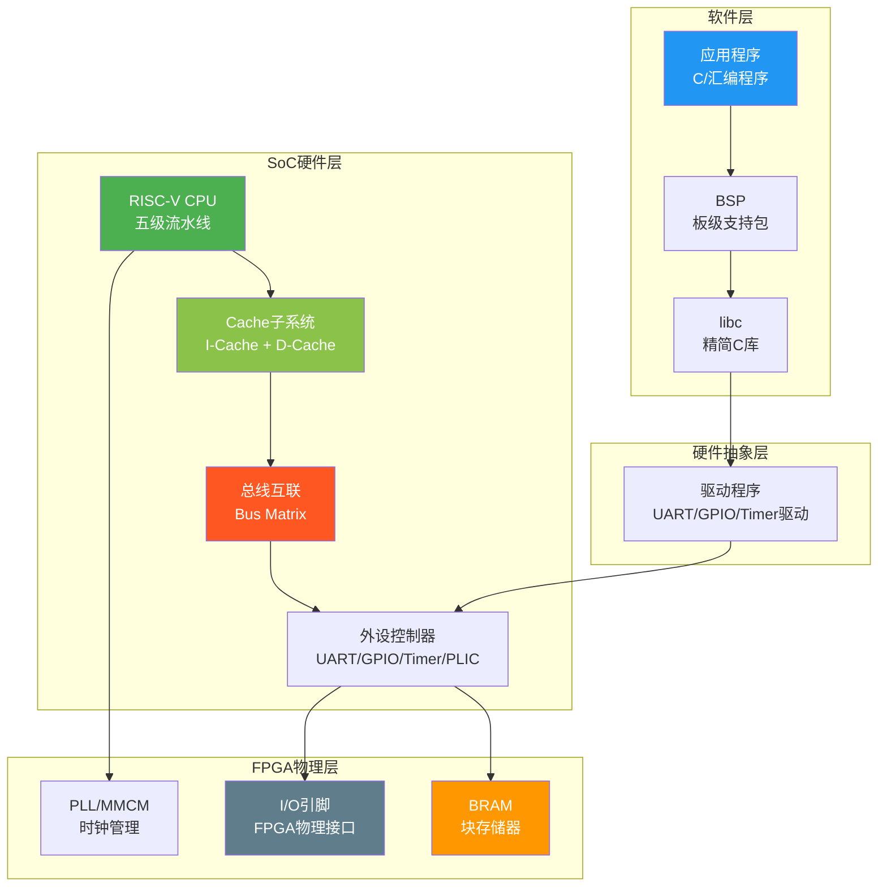

### 6.2 CPU内部模块层级图

```mermaid
graph TD
    subgraph 顶层
        TOP["riscv_top<br/>顶层模块"]
    end

    subgraph CPU核心
        CORE_M["cpu_core<br/>CPU核心模块"]
    end

    subgraph 流水线各级
        IF_M["if_stage<br/>取指模块"]
        ID_M["id_stage<br/>译码模块"]
        EX_M["ex_stage<br/>执行模块"]
        MEM_M["mem_stage<br/>访存模块"]
        WB_M["wb_stage<br/>写回模块"]
    end

    subgraph 流水线寄存器
        IF_ID["if_id_reg<br/>IF/ID寄存器"]
        ID_EX["id_ex_reg<br/>ID/EX寄存器"]
        EX_MEM["ex_mem_reg<br/>EX/MEM寄存器"]
        MEM_WB["mem_wb_reg<br/>MEM/WB寄存器"]
    end

    subgraph 功能模块
        PC_M["pc_reg<br/>PC寄存器"]
        IMEM_M["inst_mem<br/>指令存储器"]
        DMEM_M["data_mem<br/>数据存储器"]
        REG_M["reg_file<br/>寄存器堆"]
        ALU_M["alu<br/>算术逻辑单元"]
        CTRL_M["ctrl_unit<br/>控制单元"]
        IMM_M["imm_gen<br/>立即数生成"]
        HAZ_M["hazard_unit<br/>冒险检测"]
        FWD_M["forward_unit<br/>前递单元"]
        BR_M["branch_unit<br/>分支单元"]
    end

    TOP --> CORE_M
    CORE_M --> IF_M & ID_M & EX_M & MEM_M & WB_M
    IF_M --> IF_ID --> ID_M
    ID_M --> ID_EX --> EX_M
    EX_M --> EX_MEM --> MEM_M
    MEM_M --> MEM_WB --> WB_M

    IF_M --> PC_M & IMEM_M
    ID_M --> REG_M & CTRL_M & IMM_M & HAZ_M
    EX_M --> ALU_M & FWD_M & BR_M
    MEM_M --> DMEM_M
    WB_M --> REG_M

    style TOP fill:#2196F3,color:#fff
    style CORE_M fill:#4CAF50,color:#fff
    style HAZ_M fill:#FF5722,color:#fff
    style FWD_M fill:#FF5722,color:#fff
    style ALU_M fill:#9C27B0,color:#fff
    style CTRL_M fill:#FF9800,color:#fff
```

### 6.3 数据通路完整流程图

```mermaid
graph LR
    subgraph 取指IF
        PC["PC<br/>程序计数器"]
        IMEM["指令存储器<br/>取指令"]
        NPC["下一条PC<br/>计算"]
    end

    subgraph 译码ID
        DEC["指令译码<br/>生成控制信号"]
        RF_R["寄存器读<br/>rs1, rs2"]
        IMM["立即数<br/>解码"]
    end

    subgraph 执行EX
        ALU["ALU<br/>运算"]
        BR["分支判定<br/>条件判断"]
        JAL["跳转地址<br/>计算"]
    end

    subgraph 访存MEM
        DMEM["数据存储器<br/>读/写"]
        LD["Load<br/>数据读取"]
        ST["Store<br/>数据写入"]
    end

    subgraph 写回WB
        MUX_WB{"数据选择"}
        RF_W["寄存器写<br/>rd"]
    end

    PC --> IMEM --> DEC
    DEC --> RF_R
    DEC --> IMM
    RF_R --> ALU
    IMM --> ALU
    ALU --> DMEM
    DMEM --> MUX_WB
    ALU --> MUX_WB
    MUX_WB --> RF_W

    ALU --> BR
    BR --> NPC
    JAL --> NPC
    PC --> NPC
    NPC --> PC

    style PC fill:#2196F3,color:#fff
    style ALU fill:#4CAF50,color:#fff
    style IMEM fill:#FF9800,color:#fff
    style DMEM fill:#FF9800,color:#fff
    style RF_R fill:#9C27B0,color:#fff
    style RF_W fill:#9C27B0,color:#fff
```

### 6.4 开发流程与验证路线图

```mermaid
graph TD
    subgraph 第一阶段_基础层次
        P1["模块级开发"]
        P1a["ALU设计与验证"]
        P1b["寄存器堆设计与验证"]
        P1c["指令存储器/数据存储器"]
        P1d["控制器设计"]

        P2["单周期CPU集成"]
        P2a["数据通路连接"]
        P2b["控制器集成"]
        P2c["功能仿真验证"]

        P3["基础层次硬件验证"]
        P3a["综合 Synthesis"]
        P3b["布局布线 P&R"]
        P3c["比特流生成 Bitstream"]
        P3d["FPGA上板测试"]
    end

    subgraph 第二阶段_进阶层次
        P4["流水线改造"]
        P4a["添加流水线寄存器"]
        P4b["冒险检测单元"]
        P4c["前递单元"]
        P4d["流水线仿真验证"]

        P5["存储系统集成"]
        P5a["I-Cache设计"]
        P5b["D-Cache设计"]
        P5c["总线设计"]
        P5d["存储系统验证"]

        P6["外设集成"]
        P6a["UART控制器"]
        P6b["GPIO控制器"]
        P6c["Timer控制器"]
        P6d["中断控制器PLIC"]

        P7["系统级联调"]
        P7a["SoC集成"]
        P7b["启动程序测试"]
        P7c["性能量化评估"]
        P7d["进阶层次验收"]
    end

    P1a & P1b & P1c & P1d --> P2a
    P2a --> P2b --> P2c
    P2c --> P3a --> P3b --> P3c --> P3d

    P3d --> P4a
    P4a --> P4b --> P4c --> P4d
    P4d --> P5a
    P5a --> P5b --> P5c --> P5d
    P5d --> P6a
    P6a --> P6b --> P6c --> P6d
    P6d --> P7a --> P7b --> P7c --> P7d

    style P1 fill:#4CAF50,color:#fff
    style P2 fill:#4CAF50,color:#fff
    style P3 fill:#4CAF50,color:#fff
    style P4 fill:#FF9800,color:#fff
    style P5 fill:#FF9800,color:#fff
    style P6 fill:#FF9800,color:#fff
    style P7 fill:#FF9800,color:#fff
```

### 6.5 测试验证策略图

```mermaid
graph TD
    subgraph 仿真验证
        S1["单元测试<br/>Unit Test"]
        S2["集成测试<br/>Integration Test"]
        S3["系统测试<br/>System Test"]
        S4["回归测试<br/>Regression Test"]

        S1 --> S2 --> S3 --> S4
    end

    subgraph 测试方法
        T1["定向测试<br/>针对每条指令"]
        T2["随机测试<br/>随机指令序列"]
        T3["自检测试<br/>程序自检结果"]
        T4["对比测试<br/>与参考模型对比"]
        T5["覆盖率测试<br/>功能覆盖率分析"]
    end

    subgraph 参考模型
        R1["Spike ISA模拟器<br/>官方参考模型"]
        R2["RISC-V Tests<br/>官方测试集"]
        R3["自写Reference Model<br/>Python/C模型"]
    end

    subgraph 硬件验证
        H1["综合后仿真<br/>Post-Synthesis Sim"]
        H2["布局布线后仿真<br/>Post-P&R Sim"]
        H3["时序分析<br/>Timing Analysis"]
        H4["资源利用报告<br/>Utilization Report"]
        H5["上板验证<br/>FPGA On-board Test"]
    end

    S1 --> T1 & T2
    S2 --> T3 & T4
    S3 --> T5
    T4 --> R1 & R2 & R3

    S3 --> H1 --> H2 --> H3
    H3 --> H4 --> H5

    style S1 fill:#4CAF50,color:#fff
    style S3 fill:#4CAF50,color:#fff
    style T4 fill:#2196F3,color:#fff
    style R1 fill:#9C27B0,color:#fff
    style H5 fill:#FF9800,color:#fff
```

---

## 7. 方案选择建议

### 7.1 推荐方案路线

```mermaid
graph LR
    subgraph 推荐路线
        R1["步骤1<br/>单周期CPU<br/>(方案一)"]
        R2["步骤2<br/>五级流水线<br/>(方案三)"]
        R3["步骤3<br/>完整SoC<br/>(方案四)"]
    end

    R1 -->|验证ISA正确性| R2
    R2 -->|集成存储与外设| R3

    style R1 fill:#4CAF50,color:#fff
    style R2 fill:#FF9800,color:#fff
    style R3 fill:#FF9800,color:#fff
```

### 7.2 推荐理由

| 决策点 | 推荐选择 | 理由 |
|--------|---------|------|
| 基础层次架构 | 方案一（单周期） | 先验证ISA正确性，降低风险 |
| 是否做多周期 | 跳过（方案二） | 单周期已验证ISA，直接进入流水线 |
| 进阶层次架构 | 方案三（五级流水线） | 课程要求引入流水线机制 |
| 完整系统 | 方案四（SoC） | 满足"完整可运行系统"要求 |
| Cache策略 | 直接映射 + 写回 | FPGA BRAM资源适中，实现简洁 |
| 总线协议 | Wishbone B4 | 协议简单，文档清晰，适合教学 |
| 分支策略 | ID阶段判定 + 静态预测 | 平衡复杂度与性能 |

### 7.3 关键技术决策

```mermaid
graph TD
    subgraph ISA决策
        ISA1["指令集: RV32I<br/>37条基础指令"]
        ISA2["可选扩展: M扩展<br/>mul/div/rem"]
        ISA3["暂不支持: F/D/A/C<br/>浮点/原子/压缩"]
    end

    subgraph 微架构决策
        MA1["流水线深度: 5级<br/>IF-ID-EX-MEM-WB"]
        MA2["分支处理: ID阶段判定<br/>静态预测(BTFN)"]
        MA3["前递: EX→EX, MEM→EX<br/>两条前递路径"]
        MA4["Load-Use: 1周期停顿<br/>检测+bubble插入"]
    end

    subgraph 存储决策
        MEM1["I-Cache: 4KB<br/>直接映射, 16B行"]
        MEM2["D-Cache: 4KB<br/>直接映射, 写回"]
        MEM3["主存: BRAM 64KB<br/>FPGA片上存储"]
        MEM4["总线: Wishbone B4<br/>Classic模式"]
    end

    subgraph 外设决策
        PER1["UART: 115200 baud<br/>连接板载USB-UART"]
        PER2["GPIO: 16位<br/>LED/开关/按键"]
        PER3["Timer: 32位<br/>可产生周期中断"]
        PER4["PLIC: 简化版<br/>支持4个中断源"]
    end

    style ISA1 fill:#2196F3,color:#fff
    style MA1 fill:#4CAF50,color:#fff
    style MEM1 fill:#FF9800,color:#fff
    style PER1 fill:#9C27B0,color:#fff
```

### 7.4 团队分工建议

```mermaid
graph TD
    subgraph 4人团队分工
        M1["成员A<br/>CPU核心<br/>(ALU+RegFile+Ctrl)"]
        M2["成员B<br/>流水线与冒险<br/>(Pipeline+Fwd+Hazard)"]
        M3["成员C<br/>存储系统<br/>(Cache+Bus+Memory)"]
        M4["成员D<br/>外设与SoC<br/>(UART+GPIO+PLIC+集成)"]
    end

    subgraph 阶段一_基础层次
        PH1_A["A: ALU+RegFile"]
        PH1_B["B: 单周期数据通路"]
        PH1_C["C: 存储器+仿真Testbench"]
        PH1_D["D: 控制器+集成测试"]
    end

    subgraph 阶段二_进阶层次
        PH2_A["A: 流水线IF/ID级"]
        PH2_B["B: 流水线EX级+前递"]
        PH2_C["C: Cache设计+总线"]
        PH2_D["D: 外设+SoC集成+测试"]
    end

    M1 --> PH1_A & PH2_A
    M2 --> PH1_B & PH2_B
    M3 --> PH1_C & PH2_C
    M4 --> PH1_D & PH2_D

    style M1 fill:#2196F3,color:#fff
    style M2 fill:#4CAF50,color:#fff
    style M3 fill:#FF9800,color:#fff
    style M4 fill:#9C27B0,color:#fff
```

---

## 附录：Mermaid 图表索引

| 图表编号 | 图表名称 | 所在章节 |
|---------|---------|---------|
| 1 | 架构演进路线 | 1.2 |
| 2 | 整体设计层次结构 | 1.3 |
| 3 | 单周期数据通路框图 | 2.2 |
| 4 | 单周期控制信号生成 | 2.3 |
| 5 | ALU功能与指令类型 | 2.4 |
| 6 | 多周期控制器状态机 | 3.2 |
| 7 | 多周期数据通路框图 | 3.3 |
| 8 | 指令周期数分配 | 3.4 |
| 9 | 五级流水线架构总图 | 4.2 |
| 10 | 数据冒险与前递路径 | 4.3 |
| 11 | 前递逻辑详解 | 4.4 |
| 12 | 流水线时序图 | 4.5 |
| 13 | 分支处理策略 | 4.6 |
| 14 | SoC系统顶层框图 | 5.2 |
| 15 | 存储层次结构 | 5.3 |
| 16 | Cache结构设计 | 5.4 |
| 17 | 总线协议与互联 | 5.5 |
| 18 | 地址空间映射 | 5.6 |
| 19 | 中断处理流程 | 5.7 |
| 20 | 顶层系统架构图 | 6.1 |
| 21 | CPU内部模块层级图 | 6.2 |
| 22 | 数据通路完整流程图 | 6.3 |
| 23 | 开发流程与验证路线图 | 6.4 |
| 24 | 测试验证策略图 | 6.5 |
| 25 | 推荐方案路线 | 7.1 |
| 26 | 关键技术决策 | 7.3 |
| 27 | 团队分工建议 | 7.4 |

---

> 本文档包含4种架构方案和27个Mermaid系统框图，覆盖基础层次与进阶层次的全部设计需求。
> 所有Mermaid代码均可在支持Mermaid渲染的Markdown编辑器（如VS Code + Mermaid插件、Typora）中直接预览。
